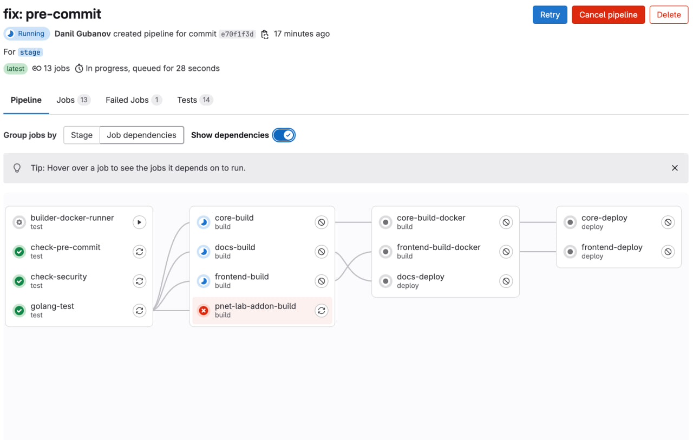

# Документация CI/CD Pipeline

Этот документ предоставляет обзор конфигурации CI/CD pipeline для проекта. Pipeline предназначен для автоматизации
процессов тестирования, сборки и развертывания приложения. Он настроен с использованием GitLab CI/CD и включает этапы
для тестирования, сборки Docker-образов и развертывания в различные среды.

## Содержание

1. [Обзор Pipeline](#обзор-pipeline)
2. [Переменные](#переменные)
3. [Этапы](#этапы)
4. [Задачи](#задачи)
5. [Правила Workflow](#правила-workflow)
6. [Диаграммы](#диаграммы)
7. [Docker files](#docker-files)

## Обзор Pipeline

Pipeline разделен на несколько этапов:

- **Тестирование**: Запускает проверки безопасности, pre-commit хуки и модульные тесты.
- **Сборка**: Собирает бинарные файлы приложения и Docker-образы.
- **Развертывание**: Развертывает приложение в указанной среде.

Pipeline запускается на основе событий веток или merge request'ов. Различные среды (например, `stage`, `pre`, `master`)
имеют специфические конфигурации и цели развертывания.

## Переменные

Pipeline использует несколько переменных для настройки процесса сборки и развертывания:

```yaml
variables:
  DOCKER_IMAGE: docker:27.5
  REGISTRY_PATH: a10869/api-modules
  GO_BASE_CI_IMAGE: "${REGISTRY_URL}/${REGISTRY_PATH}/base"
  DOCS_CI_IMAGE: "${REGISTRY_URL}/${REGISTRY_PATH}/docs"
  BACKEND_CI_IMAGE: "${REGISTRY_URL}/${REGISTRY_PATH}/backend/${DOCKER_PATH_BRANCH}"
  CLABGATE_CI_IMAGE: "${REGISTRY_URL}/${REGISTRY_PATH}/clabgate/${DOCKER_PATH_BRANCH}"
  FRONTEND_CI_IMAGE: "${REGISTRY_URL}/${REGISTRY_PATH}/frontend/${DOCKER_PATH_BRANCH}"
```

## Этапы

Pipeline состоит из следующих этапов:

1. **.pre**: Предварительные задачи (если есть).
2. **test**: Запуск тестов и проверок безопасности.
3. **build**: Сборка приложения и Docker-образов.
4. **deploy**: Развертывание приложения в целевой среде.
5. **.post**: Пост-задачи (если есть).

## Задачи

### Этап тестирования

#### `check-security`

- **Описание**: Запускает проверки безопасности с использованием пользовательского скрипта.
- **Образ**: `$GO_BASE_CI_IMAGE:latest`
- **Скрипт**: `make security`

#### `check-pre-commit`

- **Описание**: Запускает pre-commit хуки.
- **Образ**: `$GO_BASE_CI_IMAGE:latest`
- **Скрипт**: `make pre_commit`

#### `golang-test`

- **Описание**: Запускает модульные тесты на Go и генерирует отчеты о покрытии.
- **Образ**: `$GO_BASE_CI_IMAGE:latest`
- **Сервисы**: База данных MySQL для тестирования.
- **Скрипт**: `make test`
- **Артефакты**: Отчеты о покрытии и результаты тестов JUnit.

### Этап сборки

#### `core-build`

- **Описание**: Собирает backend приложение.
- **Образ**: `$GO_BASE_CI_IMAGE:latest`
- **Скрипт**: `make build`
- **Артефакты**: Собранные бинарные файлы.

#### `core-build-docker`

- **Описание**: Собирает и загружает Docker-образ для backend.
- **Образ**: `$DOCKER_IMAGE`
- **Скрипт**: Собирает и загружает Docker-образ в реестр.

#### `frontend-build`

- **Описание**: Собирает frontend приложение.
- **Образ**: `$GO_BASE_CI_IMAGE:latest`
- **Скрипт**: `yarn build`
- **Артефакты**: Собранные frontend ассеты.

#### `frontend-build-docker`

- **Описание**: Собирает и загружает Docker-образ для frontend.
- **Образ**: `$DOCKER_IMAGE`
- **Скрипт**: Собирает и загружает Docker-образ в реестр.

#### `docs-build`

- **Описание**: Собирает и загружает Docker-образ для документации.
- **Образ**: `$DOCKER_IMAGE`
- **Скрипт**: Собирает и загружает Docker-образ в реестр.

#### `pnet-lab-addon-build`

- **Описание**: Собирает пакет дополнения PNet Lab.
- **Образ**: `$GO_BASE_CI_IMAGE:latest`
- **Скрипт**: Собирает и упаковывает дополнение, затем загружает его в реестр.

### Этап развертывания

#### `core-deploy`

- **Описание**: Развертывает backend приложение.
- **Образ**: `$DOCKER_IMAGE`
- **Скрипт**: Подключается к целевому серверу через SSH и запускает `docker-compose up -d`.

#### `frontend-deploy`

- **Описание**: Развертывает frontend приложение.
- **Образ**: `$DOCKER_IMAGE`
- **Скрипт**: Подключается к целевому серверу через SSH и запускает `docker-compose up -d`.

#### `docs-deploy`

- **Описание**: Развертывает документацию.
- **Образ**: `$DOCKER_IMAGE`
- **Скрипт**: Подключается к целевому серверу через SSH и запускает `docker-compose up -d`.

## Правила Workflow

Pipeline использует правила workflow для определения, какие переменные с префиксами будут запускать одинаковый процесс с
разными переменными в зависимости от ветки:

```yaml
workflow:
  rules:
    - if: $CI_COMMIT_REF_SLUG == "stage"
      variables:
        DOCKER_PATH_BRANCH: stage
        SENTRY_DEPLOY_ENVIRONMENT: stage
        SSH_USER: "${STAGE_SSH_USER}"
        SSH_HOST: "${STAGE_SSH_HOST}"
        SSH_PORT: "${STAGE_SSH_PORT}"
        SSH_PRIVATE_KEY: "${STAGE_SSH_PRIVATE_KEY}"
    - if: $CI_COMMIT_REF_SLUG == "pre"
      variables:
        DOCKER_PATH_BRANCH: pre
        SENTRY_DEPLOY_ENVIRONMENT: pre
        SSH_USER: "${PRE_SSH_USER}"
        SSH_HOST: "${PRE_SSH_HOST}"
        SSH_PORT: "${PRE_SSH_PORT}"
        SSH_PRIVATE_KEY: "${PRE_SSH_PRIVATE_KEY}"
    - if: $CI_COMMIT_REF_SLUG == "master"
      variables:
        DOCKER_PATH_BRANCH: master
        SENTRY_DEPLOY_ENVIRONMENT: prod
        SSH_USER: "${MASTER_SSH_USER}"
        SSH_HOST: "${MASTER_SSH_HOST}"
        SSH_PORT: "${MASTER_SSH_PORT}"
        SSH_PRIVATE_KEY: "${MASTER_SSH_PRIVATE_KEY}"
    - if: $CI_PIPELINE_SOURCE == "merge_request_event"
```

## Диаграммы

### Схема Pipeline



## Docker files

[Подробнее про docker](docker.md)
