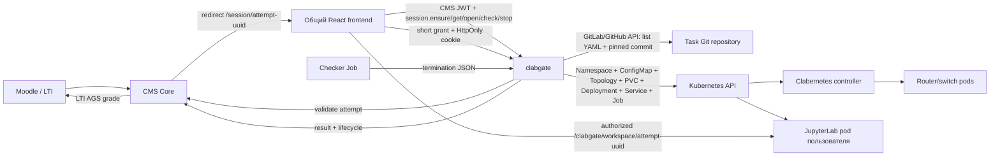
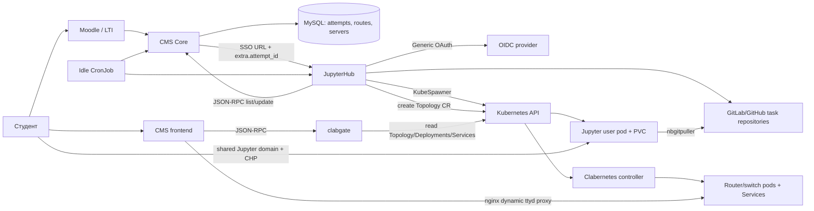
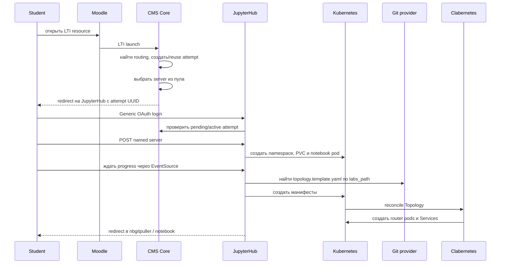
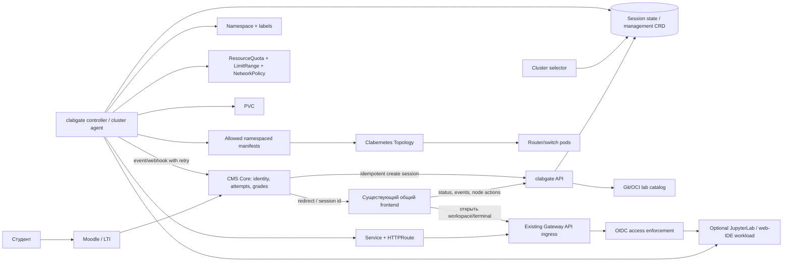

# clabgate: Kubernetes-сессии лабораторий без JupyterHub

`clabgate` можно превратить в самостоятельный execution plane для сетевых лабораторий. Рекомендуемая граница ответственности:

- `cms-labs backend` остаётся владельцем LTI, пользователей, попыток и синхронизации оценок с Moodle;
- `clabgate` становится владельцем жизненного цикла среды: namespace, лимиты, хранилище, топология, workspace, маршрут, readiness и удаление;
- JupyterHub и KubeSpawner удаляются из контура;
- JupyterLab остаётся опциональным runtime обычного Kubernetes workload, наравне с web-IDE или режимом без workspace;
- материалы лаборатории становятся декларативным и версионируемым контрактом в Git, а не набором соглашений, зашитых в spawner.

Это не требует немедленного форка Clabernetes или написания нового UI. Сначала достаточно расширить существующий Go-сервис API и добавить reconciler. Мультикластерность лучше вводить после успешного single-cluster cutover.

API Docs: [https://cms-lab.gubanov.site/clabgate/api/docs](https://cms-lab.gubanov.site/clabgate/api/docs)

Воспроизводимый локальный end-to-end стенд на kind, включая Clabernetes,
Jupyter, workspace auth и checker: [k8s/local-kind/README.md](../k8s/local-kind/README.md).

## Реализованный первый вертикальный срез

В этой ветке `clabgate` уже не ограничен чтением готовой топологии. Реализован переходный single-cluster runtime, в котором Kubernetes API является источником истины для живых сессий, а существующий общий frontend монорепозитория — единственной пользовательской web-мордой.



Путь запуска теперь такой:

1. CMS создаёт attempt как раньше. Для server с типом `k8s` он возвращает `/session/<attempt UUID>` вместо URL JupyterHub SSO.
2. Страница `nextui-dashboard/app/(app)/session/page.tsx` вызывает идемпотентный `session.ensure`.
3. `clabgate` проверяет CMS JWT и принадлежность активной попытки текущему `sub`.
4. Создаётся namespace `lab-<attempt UUID>` с labels/annotations сессии.
5. `CMS_TASK_URL` разбирается как полный URL GitLab- или GitHub-проекта. Через API провайдера рекурсивно загружаются YAML из каталога `labs_path`, а точный commit SHA фиксируется в namespace. Разрешены только `v1/ConfigMap` и один `clabernetes Topology`; другие GVK отклоняются.
6. В том же namespace создаются PVC, standalone JupyterLab Deployment и фиксированный Service `jupyter`. Jupyter — приложение сессии, а не JupyterHub single-user server.
7. UI опрашивает `session.get`, показывает readiness topology/workspace и вызывает `session.open`. Короткий подписанный grant обменивается на scoped `Secure`/`HttpOnly` cookie; nginx делает `auth_request` перед каждым HTTP/WebSocket запросом к Jupyter.
8. Фоновый reconciler под leader election сопоставляет attempts с namespace по immutable UUID. `pending -> active` выполняется только когда готовы Jupyter и Topology; `terminating` удаляется и подтверждается как `completed`. Старый JupyterHub idle CronJob для этого потока не нужен.

Jupyter находится в namespace топологии, но не является узлом containerlab: так он не попадает под lifecycle сетевого node Deployment и обращается к узлам по Kubernetes Services. Это более устойчивое разделение приложения и эмулируемой сети.

### JSON-RPC контракт

| Метод | Назначение |
|---|---|
| `session.ensure {attempt_id}` | Проверить attempt в CMS и идемпотентно создать desired resources |
| `session.get {session_id}` | Получить состояние, вычисленное из Namespace/Deployment/Topology/Job |
| `session.list {}` | Получить свои сессии; admin/instructor видит все |
| `session.check {session_id}` | Запустить одну checker Job в namespace сессии |
| `session.open {session_id}` | Проверить ownership/роль и выдать короткий URL обмена на workspace cookie |
| `session.stop {session_id}` | Удалить namespace; garbage collector удалит namespaced resources |
| `topology.get {session_id}` | Получить topology для нового immutable session ID |
| `node.action {session_id, actions}` | Выполнить совместимые действия над узлами с ownership check |

Legacy-параметры `username + attempt_number` и прямой nginx-маршрут удалены; topology и node actions работают только через immutable `session_id`.

### Kubernetes-контракт сессии

Namespace имеет labels `app.kubernetes.io/managed-by=clabgate`, `labs.cmslabs.ru/session-id` и `labs.cmslabs.ru/owner-id`. Остальная информация (`attempt-id`, username, `lab-path`, `test-path`, title, runtime, source revision, session phase и ready-at) хранится в annotations. Поэтому список сессий восстанавливается после рестарта clabgate простым Kubernetes list и не требует собственной БД или новой CRD.

В namespace создаются:

- разрешённые ConfigMap и один `Topology` из лабораторного шаблона;
- `PersistentVolumeClaim/jupyter`;
- `Deployment/jupyter` и `Service/jupyter:8888`;
- `Job/checker-*` только после явного `session.check`.

`session.ensure` заканчивается после принятия desired resources API-сервером, а не ждёт запуска образов. Состояния `pending`, `provisioning`, `ready`, `degraded`, `failed`, `stopping` вычисляются из фактических объектов Kubernetes.

### Контракт checker image

Образ из `CHECKER_IMAGE` запускается без Kubernetes credentials и без монтирования RWO Jupyter PVC, в namespace лаборатории, с переменными:

```text
SESSION_ID
ATTEMPT_ID
SESSION_NAMESPACE
LAB_PATH
TEST_PATH
```

Проверяющая программа должна завершиться с кодом `0` и записать в `/dev/termination-log` один JSON размером до Kubernetes termination-message limit:

```json
{
  "max_score": 10,
  "current_score": 8,
  "result_display": "8 из 10 проверок выполнено",
  "report": "Краткий Markdown-отчёт",
  "tasks": [
    {
      "title": "Проверка SSH",
      "description": "Маршрутизатор принимает SSH-подключения",
      "logs": [
        {"node": "r1", "namespace": "lab-example", "message": "Соединение установлено"}
      ],
      "complete": true
    }
  ]
}
```

`tasks` опционален, поэтому старые checker images остаются совместимыми. Новые checker images и отдельные реализации лабораторных находятся в репозитории [`github.com/maintainer64/cms-labs-checker`](https://github.com/maintainer64/cms-labs-checker). `TEST_PATH` выбирает зарегистрированный пакет проверки, а при пустом значении используется basename `LAB_PATH`.

Reconciler валидирует диапазон оценки, добавляет стабильный `check_id` и последние 64 КиБ сырых логов Pod, передаёт результат через существующий `lti_attempt.update_external`, а CMS синхронизирует его с Moodle через AGS. CMS идемпотентно принимает повтор того же `check_id`; успешная доставка также помечается annotation на Job. Нулевая оценка допустима и отправляется в LMS.

### Конфигурация

| Переменная | Назначение / default |
|---|---|
| `JWT_SECRET_KEY_PUBLIC` | PEM RSA public key CMS; обязателен для проверки JWT |
| `JWT_ISSUER`, `JWT_AUDIENCE` | Дополнительная строгая проверка issuer/audience |
| `CMS_URL` | URL CMS Core |
| `CMS_LOGIN`, `CMS_PASSWORD` | service client, соответствующий k8s server в CMS |
| `CMS_TIMEOUT_SECONDS` | timeout CMS API, `30` |
| `CMS_TASK_URL` | полный URL GitLab- или GitHub-проекта, например `https://github.com/org/tasks` |
| `CMS_TASK_BRANCH` | Git ref каталога, `master`; при запуске разрешается в commit SHA |
| `TASK_REPOSITORY_TOKEN` | optional token для private GitLab/GitHub repository |
| `GITLAB_TOKEN` | legacy fallback для `TASK_REPOSITORY_TOKEN` на время миграции |
| `JUPYTER_IMAGE` | standalone notebook image со `start-notebook.py`; production default — `ghcr.io/maintainer64/cms-labs-jupyter:latest` |
| `JUPYTER_STORAGE_SIZE` | размер PVC, `1Gi` |
| `WORKSPACE_PROXY_PREFIX` | URL prefix Jupyter, `/clabgate/workspace` |
| `WORKSPACE_AUTH_SECRET` | общий для replicas HMAC secret, минимум 32 байта; обязателен для `session.open` |
| `WORKSPACE_GRANT_TTL_SECONDS` | TTL одноцелевого grant, `60` |
| `WORKSPACE_COOKIE_TTL_SECONDS` | TTL scoped HttpOnly cookie, `3600` |
| `SESSION_RECONCILE_INTERVAL_SECONDS` | период сверки Kubernetes/CMS, `30` |
| `CHECKER_IMAGE` | образ checker; без него `session.check` явно вернёт ошибку |
| `CHECKER_TIMEOUT_SECONDS` | active deadline checker Job, `600` |

ServiceAccount/RBAC в `k8s/values/_common/clabgate-values.yaml` расширен ровно на создаваемые namespaced ресурсы и Namespace. Для Topology namespace включён Pod Security `privileged`, поскольку сетевые node workloads Clabernetes требуют соответствующих возможностей.

### Что ещё не завершено

- Нет live-cluster smoke test: локального kubeconfig/кластера сейчас нет. Kubernetes orchestration покрыт fake-client тестом, включая multi-document manifest и повторный ensure.
- Standalone Jupyter image проверяется собственным CI: запуск сервера, импорт библиотек всех текущих notebook и совместимость legacy SNMP API.
- Загрузка notebook пока использует `nbgitpuller`, но и Kubernetes-манифесты, и notebook checkout закреплены по разрешённому commit SHA.
- `topology.get` выдаёт ttyd только как короткоживущий grant: frontend обменивает его на scoped HttpOnly cookie и проксирует HTTP/WebSocket в namespace сессии.
- Ещё нет ResourceQuota, LimitRange, NetworkPolicy, TTL/idle policy и informer cache. Две replicas reconciler координируются Kubernetes Lease.
- `Topology` GVR соответствует используемому локальному fork `clabernetes.containerlab.dev/v1alpha1`; перед обновлением upstream нужна миграция API group/version.

Локальная проверка без кластера:

```bash
cd clabgate && GOCACHE=/tmp/clabgate-go-build go test ./...
cd ../nextui-dashboard && ./node_modules/.bin/tsc --noEmit
cd ../nextui-dashboard && ./node_modules/.bin/eslint app components helpers --max-warnings 0
cd ../nextui-dashboard && ./node_modules/.bin/vite build
```

## Что было изучено

Разделы ниже сохранены как исходный аудит до реализации вертикального среза.
Формулировки «сейчас/сегодня» описывают прежний JupyterHub-контур. Актуальный
production-контракт и отложенные задачи находятся в [`PLAN.md`](PLAN.md).

Анализ основан на текущем коде следующих локальных проектов:

- `cms-labs-urfu/backend` — LTI, SSO/OIDC, попытки, распределение по серверам и оценки;
- `cms-labs-urfu/clabgate` — чтение состояния Clabernetes и действия с pod;
- `cms-labs-urfu/nextui-dashboard` — собственная визуализация топологии и ttyd proxy;
- `jupyter/cmsspawner` — KubeSpawner, запуск named server, загрузка topology и idle sync;
- `jupyter/k8s` — Helm values, RBAC, Gateway API и CronJob;
- `cms_task_collection` — коллекция лабораторных, notebook и `topology.template.yaml`;
- локальный `cms-labs-clabernetes/ui` — UI поддерживаемого CMS Labs fork.

Локальные незакоммиченные файлы в соседних репозиториях не изменялись.

## Текущая архитектура



### Текущий путь запуска



Важная деталь: orchestration распределён между браузером, JupyterHub, CMS, CronJob и Kubernetes. Поэтому частичный сбой легко оставляет notebook без топологии, namespace без корректного статуса попытки или попытку без живой среды.

## Фактические зависимости

| Компонент | От чего зависит | За что сейчас отвечает |
|---|---|---|
| CMS Core | MySQL, Moodle LTI, OIDC/SSO, routing data | Создаёт attempt, хранит `labs_path`, выбирает server, синхронизирует оценку |
| JupyterHub | KubeSpawner, GenericOAuthenticator, CHP, MySQL, Vault, CMS JSON-RPC, Git provider, Kubernetes | Авторизация, namespace/PVC/pod, ожидание, загрузка topology, маршрутизация к notebook |
| Browser waiting page | JupyterHub API и EventSource | Последовательно запускает server, ждёт его, затем запускает topology |
| Idle CronJob | JupyterHub API, CMS JSON-RPC, Vault | Сопоставляет named servers с attempts и двигает lifecycle |
| Clabernetes | Topology CRD, Kubernetes | Разворачивает сетевые узлы и сервисы |
| clabgate | Непроверенный CMS JWT, Kubernetes API, соглашение об имени namespace | Читает topology/deployments/services и удаляет/перезапускает pod |
| CMS frontend | clabgate, React Flow, nginx DNS proxy | Рисует topology и проксирует ttyd WebSocket |
| Task collection | Git submodules, notebook image, custom IPython startup, topology template convention | Хранит учебные материалы и часть topology |

## Что уже умеет clabgate

- `session.ensure` создаёт namespace `lab-<attempt UUID>`, Topology, PVC, Jupyter Deployment и Service;
- `topology.get` и `node.action` принимают только `session_id`, проверяют владельца и работают в найденном namespace;
- ttyd из CMS Labs Clabernetes fork остаётся `ClusterIP` и доступен только через session-scoped workspace proxy;
- `session.check` запускает checker Job и отправляет структурированный результат в CMS;
- две replicas reconciler координируются Kubernetes Lease.

## Проблемы, которые нужно исправить независимо от миграции

### Критические

1. Нужны ResourceQuota, LimitRange и default-deny NetworkPolicy для каждого session namespace.
2. Нужна политика idle timeout/TTL и гарантированная очистка зависших namespace.
3. Разрешённые типы Kubernetes-объектов из task repository должны оставаться ограничены валидатором Clabgate.

### Надёжность и производительность

- live status пока опрашивается, а не доставляется через SSE/WebSocket;
- `context.Background()` не наследует отмену HTTP-запроса и deadline;
- список pods запрашивается отдельно для каждого deployment;
- ошибки при чтении deployments/services/ttyd отбрасываются;
- ошибка `executor.StreamWithContext` при restart игнорируется;
- при нескольких replicas/pods выбирается последний элемент без проверки readiness;
- `GetTopologyYAML` возвращает первый Topology в namespace, а не ресурс по имени/owner label;
- список `ServiceInfo` всё ещё ориентирован на внешние адреса, тогда как ttyd обнаруживается отдельным namespace-local запросом;
- зависимости notebook почти не закреплены по версиям, поэтому образ невоспроизводим;
- topology templates и notebooks не имеют машинно-проверяемого общего manifest.

## Коллекция лабораторных и требования к runtime

В `cms_task_collection` сейчас четыре Git submodule с пятью `.ipynb` и тремя `topology.template.yaml`.

| Модуль | Notebook | Topology | Особенности |
|---|---:|---:|---|
| `SDN_Lab_3_1` | 1 | нет | Python notebook без собственной topology |
| `SDN_Lab_4` | 2 | да | `%postman`, `%%ssh`, RESTCONF, ConfigMap startup config |
| `SDN_Lab_5_1` | 1 | да | Paramiko, pandas, SNMP, matplotlib, Cisco IOL |
| `SDN_Lab_5_2` | 1 | да | ncclient, lxml/XML, pandas, Arista cEOS |

Из этого следуют два ограничения:

1. Полностью заменить JupyterLab на code-server/OpenVSCode без изменения материалов нельзя: IPython magic `%%ssh` и `%postman`, виджеты и выполнение notebook должны где-то сохраниться.
2. Не каждой лаборатории нужна topology, поэтому runtime и topology должны быть независимыми optional-секциями определения лаборатории.

Рекомендуется сохранить Jupyter runtime для существующих notebook, а web-IDE вводить как новый профиль. После этого отдельные лабораторные можно постепенно переводить на Markdown/scripts/tests.

## Целевая архитектура



### Граница ответственности

#### CMS Core

- принимает и проверяет LTI launch;
- связывает Moodle subject, курс и resource link с внутренним пользователем;
- создаёт attempt и хранит оценку;
- вызывает idempotent API `clabgate`;
- показывает минимальную страницу ожидания или делает redirect;
- принимает события `ready`, `failed`, `stopped`, `completed`;
- синхронизирует итог с Moodle через AGS.

CMS не должен знать имена pod, PVC, namespace или устройство Clabernetes.

#### Существующий общий frontend

- остаётся единственным student-facing UI монорепозитория;
- показывает ожидание и progress по status/SSE API `clabgate`;
- отображает topology и разрешённые действия над узлами;
- открывает Jupyter/web-IDE/terminal по URL готовой session;
- не применяет Kubernetes manifests и не управляет последовательностью provisioning в браузере.

Новый frontend и встраивание `containerlab-app` для запуска лабораторий не требуются. Из `clab-ui` при необходимости можно заимствовать отдельные идеи визуализации, не добавляя второй пользовательский интерфейс или второй lifecycle backend.

#### clabgate

- проверяет service/OIDC token и idempotency key;
- разрешает точный `labRef` в immutable Git commit или OCI digest;
- выбирает cluster по политике и доступной ёмкости;
- создаёт `LabSession` desired state;
- reconciler создаёт и обновляет ресурсы;
- публикует status conditions и URL;
- удаляет среду по TTL или команде;
- повторяет callback в CMS через outbox до подтверждения.

`clabgate` должен уметь работать через generic API без Moodle. CMS-интеграция — adapter, а не часть Kubernetes-контроллера.

### Расширять clabgate или создавать новый сервис

Рекомендуется сохранить имя, репозиторий, CI/Helm и совместимые read/action endpoints `clabgate`, но разделить процесс на два бинарных entrypoint:

```text
clabgate/
├── cmd/api                    # HTTP, auth, idempotency, session API
├── cmd/controller             # reconcile LabSession в одном cluster
├── internal/session           # domain model и state transitions
├── internal/catalog           # Git/OCI resolution и lab.yaml validation
├── internal/reconciler        # desired resources и finalizers
├── internal/platform/kube     # typed/dynamic clients, SSA, informers
├── internal/adapter/cms       # optional callbacks/client CMS
└── internal/auth              # OIDC/JWKS и service authentication
```

На первом этапе API и controller могут поставляться одним image и двумя Deployments. Это сохраняет простоту монорепозитория, но падение HTTP handler не останавливает reconciliation. Создавать третий продукт или форкать Clabernetes не требуется. Если позже появятся worker clusters, тот же controller становится cluster agent.

#### Clabernetes

- остаётся владельцем преобразования `Topology` CR в workloads сетевых узлов;
- не получает знания о пользователях, Moodle, attempts и доменах;
- штатный controller не нужно форкать ради session lifecycle.

#### Каталог лабораторных

- хранит notebook, topology, startup configs и тесты;
- содержит единый `lab.yaml` в корне каждого модуля;
- версия сессии всегда закрепляется на commit SHA/digest;
- CI валидирует schema, topology, образы, ресурсы и запрещённые GVK.

## Предлагаемый контракт лаборатории

Пример начального формата; точная CRD/schema должна быть утверждена до реализации:

```yaml
apiVersion: labs.cmslabs.ru/v1alpha1
kind: LabDefinition
metadata:
  name: sdn-lab-5-2
spec:
  title: NETCONF monitoring
  runtime:
    type: jupyter # jupyter | webide | none
    image: harbor.k8s.cmslabs.ru/svc_jupyter/notebook@sha256:...
    command: ["jupyter", "lab"]
    entrypoint: Lab5_2.ipynb
    resources:
      requests: {cpu: 500m, memory: 1Gi}
      limits: {cpu: "2", memory: 4Gi}
    storage:
      size: 1Gi
      retention: Delete
  topology:
    manifests:
      - topology.yaml
  access:
    exposeWorkspace: true
    idleTimeout: 45m
    hardTimeout: 4h
  policy:
    allowedManifestKinds:
      - v1/ConfigMap
      - clabernetes.containerlab.dev/v1alpha1/Topology
```

Отдельный runtime позволяет `SDN_Lab_3_1` работать без topology, а topology-only заданиям — не поднимать notebook.

### LabSession как desired state

```yaml
apiVersion: labs.cmslabs.ru/v1alpha1
kind: LabSession
metadata:
  name: s-01j...
spec:
  externalAttemptId: "uuid-from-cms"
  subjectId: "immutable-user-id"
  labRef:
    name: sdn-lab-5-2
    revision: "git-commit-sha"
  expiresAt: "2026-09-12T15:00:00Z"
  runtimeOverride: {}
status:
  phase: Ready
  cluster: prod-1
  namespace: lab-01j...
  url: https://01j....labs.example.org/
  conditions: []
```

Для имён ресурсов используется непрозрачный session id. Username и email остаются labels/annotations только там, где это допустимо политикой персональных данных.

## Применение произвольных manifest

Требование «как `kubectl apply`» реализуемо, но не должно означать «разрешить лабораторной создать что угодно».

Рекомендуемый pipeline:

1. Прочитать lab definition и manifest только из закреплённой revision.
2. Разобрать все YAML documents и выполнить schema validation.
3. Отклонить cluster-scoped resources, `Namespace`, RBAC, CRD, webhook, privileged host mounts и неизвестные GVK.
4. Принудительно установить session namespace и ownership labels.
5. Наложить platform defaults: quota, limits, security context, pull secrets, network policy.
6. Применить ресурсы через client-go discovery + RESTMapper + dynamic client с server-side apply и отдельным field manager.
7. Сохранить inventory применённых объектов, чтобы удаление и drift reconciliation были детерминированными.

Это исправляет недостатки текущего `KubectlTopology`: поддерживаются обычные `apps/v1`, `batch/v1` и CRD, обновления идемпотентны, plural берётся из API discovery, а не угадывается.

## Namespace, ресурсы и размещение

Для каждой сессии reconciler создаёт:

- Namespace с session id и Pod Security labels, требуемыми Clabernetes;
- ResourceQuota на суммарные CPU, RAM, PVC и количество объектов;
- LimitRange с defaults, чтобы manifest не мог создать безлимитный container;
- default-deny NetworkPolicy и явные DNS/CMS/Git/registry/management разрешения;
- controlled imagePullSecret reference;
- PVC только если его требует runtime/topology;
- Topology и дополнительные разрешённые manifests;
- optional workspace Deployment/StatefulSet, Service и HTTPRoute;
- owner labels/finalizer для очистки.

Kubernetes scheduler должен выбирать node. `clabgate` выбирает cluster и задаёт policy (`nodeSelector`, affinity, tolerations, RuntimeClass), но не реализует собственный node scheduler.

### Выбор cluster

Для первого релиза достаточно одного cluster и интерфейса `ClusterSelector`. Затем:

1. каждый cluster публикует heartbeat, allocatable capacity, поддерживаемые образы/runtime и health;
2. API отбрасывает несовместимые/нездоровые clusters;
3. scheduler учитывает requests всей лаборатории, текущие active sessions, affinity курса и вес cluster;
4. решение закрепляется за session и не меняется после provisioning;
5. agent в выбранном cluster pull-моделью получает desired state либо watch-ит management API.

Pull-agent предпочтительнее хранения cluster-admin kubeconfig всех clusters в центральном API. Полноценную мультикластерность не следует делать обязательным условием первого cutover.

## Jupyter без JupyterHub

JupyterLab запускается обычным workload:

1. init container клонирует конкретный commit лаборатории в PVC;
2. основной container запускает `jupyter lab`, а не `jupyterhub-singleuser`;
3. текущие IPython startup scripts и зависимости notebook переносятся в neutral runtime image;
4. readiness probe проверяет Jupyter Server API;
5. Service и HTTPRoute публикуют workspace;
6. lifecycle и удаление выполняет `LabSession` reconciler.

`nbgitpuller` можно оставить как временную совместимость, но воспроизводимее клонировать pinned revision init container-ом. Изменения студента сохраняются в session PVC.

Образ notebook нужно отделить от версии JupyterHub и закрепить Python packages lock-файлом. Особое внимание требуется совместимости custom `%postman`, `%%ssh`, `pysnmp` legacy API, `ncclient` и `lxml`.

### Домен пользователя

Рекомендуемый адрес — не сырой username, а непрозрачный стабильный slug и session id:

```text
https://<user-slug>-<session-id>.labs.example.org/
```

Если гарантирована ровно одна активная лаборатория, возможен `<user-slug>.labs.example.org`, но тогда повторный запуск и параллельные попытки конфликтуют. Для схемы нужны wildcard DNS, wildcard certificate и Gateway listener, разрешающий `HTTPRoute` из session namespaces.

Без JupyterHub CHP исчезает, но остаются две неизбежные функции:

- L7 routing от hostname к Service — это существующий Kubernetes Gateway/Ingress;
- проверка доступа перед приложением — Jupyter token, auth sidecar или централизованная OIDC policy на gateway.

Предпочтение: централизованная OIDC/ext-auth policy на Gateway. Если текущий Gateway не умеет её безопасно применять, временно использовать небольшой auth sidecar на workspace. Нельзя публиковать Jupyter/code-server/ttyd только по трудно угадываемому URL.

## Что делать с web UI Clabernetes

Изученный UI Clabernetes умеет:

- list/create/edit/delete Topology;
- выбирать namespace и secrets;
- визуализировать Topology, Deployment, Service и Connectivity;
- редактировать YAML в Monaco Editor.

Monaco — редакторное ядро, используемое VS Code, но это не полноценный VS Code workspace. В изученном коде нет notebook runtime, terminal/ttyd, LTI flow, OIDC tenant mapping или ограничения пользователя его session.

Кроме того, UI работает server-side с Kubernetes service account Clabernetes manager, выводит все namespaces и предоставляет CRUD. Поэтому рекомендуемое применение:

- оставить его как admin/instructor UI;
- поставить перед ним OIDC и разрешить только административные роли;
- по возможности дать отдельный read-mostly service account, а не manager credentials;
- не использовать его как student launch page без существенной доработки authorization и tenant filtering.

Существующий общий frontend монорепозитория следует сохранить как единственный student UI. Из него нужно убрать orchestration запуска: frontend показывает состояние `LabSession`, получает progress через API/SSE, отображает topology и разрешённые действия, а после `Ready` открывает Jupyter/web-IDE. Визуализацию topology и ttyd не нужно переносить в отдельное приложение.

### Важное состояние upstream

В актуальном upstream Clabernetes встроенный UI больше не является поддерживаемой частью проекта: удаление UI вошло в release `v0.7.0`. Поэтому `ui.enabled=true` нельзя считать возможностью нового upstream chart. `cms-labs-clabernetes` — явно версионируемый fork с ttyd/tmux-интеграцией; student UI при этом остаётся в CMS Labs frontend.

### Что уже готово в локальном `c9s`

Проект `c9s` уже разворачивает сохранённый UI:

- `c9s/k8s/values.template.yaml` включает `ui.enabled: true` и один replica;
- `c9s/k8s/ingress-https.template.yaml` направляет `c9s.${INGRESS_HOSTNAME}` в Service `clabernetes-ui:80`;
- для `master` ожидаемый адрес — `https://c9s.k8s.cmslabs.ru`, для pre-веток — `https://c9s.k8s-pre.cmslabs.ru`;
- chart создаёт UI как Next.js Deployment и Service, а UI обращается к Kubernetes API из pod.

Без внешнего Kubernetes локально его можно проверить в disposable `kind`-кластере. В текущем окружении установлен Docker client и Helm, но `kind` отсутствует; команды ниже не запускались:

```bash
brew install kind
kind create cluster --name c9s-ui

cd /Users/gubanov/golang/cms-labs-clabernetes
helm upgrade --install clabernetes ./charts/clabernetes \
  --namespace clabernetes --create-namespace \
  --set ui.enabled=true \
  --set ui.ingress.enabled=false \
  --set ui.replicaCount=1

kubectl -n clabernetes port-forward service/clabernetes-ui 3000:80
```

После этого UI доступен на `http://127.0.0.1:3000`. Сам UI и Kubernetes CRUD можно проверить на macOS, но полноценный запуск сетевых образов в `kind` поверх Docker Desktop зависит от privileged mode, nested container runtime и доступности vendor images. Это не следует считать production-проверкой Clabernetes data plane.

### K9s — не web UI

K9s предоставляет terminal UI и работает с правами текущего kubeconfig; собственного HTTP-сервера или browser mode у него нет. Это прямо указано в [официальном README K9s](https://github.com/derailed/k9s). Его технически можно показать в браузере через `ttyd`/`wetty`, но тогда наружу публикуется административный терминал с Kubernetes credentials. Для student-facing интерфейса это неподходящая модель; максимум — закрытый OIDC/VPN admin-инструмент с отдельным read-only ServiceAccount.

### Современный web UI Containerlab

Вероятный интерфейс «как в VS Code» — [containerlab-app](https://github.com/srl-labs/containerlab-app), использующий тот же пакет [clab-ui](https://github.com/srl-labs/clab-ui), что и VS Code extension. У него есть:

- полностью локальный browser sandbox для редактирования и визуализации `*.clab.yml`;
- web image `ghcr.io/srl-labs/containerlab-web`;
- desktop app;
- deploy/destroy, events и interactive sessions при подключении к [clab-api-server](https://github.com/srl-labs/clab-api-server).

Но это другой execution backend. `containerlab-app` вызывает `clab-api-server` на Linux-хосте, который владеет Docker/containerlab, Linux users, network namespaces и файлами лабораторий. Он не создаёт Clabernetes `Topology` CR, namespace, PVC, ResourceQuota или HTTPRoute. Поэтому варианты такие:

| Вариант | Подходит для | Ограничение |
|---|---|---|
| Сохранённый `clabernetes-ui` из `c9s` | Admin/instructor UI поверх текущего Kubernetes fork | Старый удалённый upstream-компонент, слишком широкие права |
| `containerlab-app` sandbox | Редактирование и визуализация topology без инфраструктуры | Реальные лаборатории не запускает |
| `containerlab-app` + `clab-api-server` | Один или несколько Linux lab hosts без Kubernetes | Отдельный privileged execution plane; не Clabernetes |
| K9s через `ttyd` | Временный закрытый admin terminal | Не student UI и высокий риск credentials |

Для целевой архитектуры существующий общий frontend остаётся единственным student-facing интерфейсом, а `clabgate` владеет `LabSession` и Kubernetes resources. Сохранённый Clabernetes UI можно временно оставить администраторам; `containerlab-app` нужен максимум как отдельный authoring/visualization tool и не должен встраиваться в student lifecycle. Если будет принято решение отказаться не только от JupyterHub, но и от Kubernetes/Clabernetes, тогда `clab-api-server` становится альтернативой `clabgate`, а не его UI.

## API первого релиза

JSON-RPC можно временно сохранить adapter-ом, но новый lifecycle удобнее выразить REST:

```text
POST   /api/v1/sessions                 idempotent create/reuse
GET    /api/v1/sessions/{id}            phase, conditions, URL
GET    /api/v1/sessions/{id}/events     SSE provisioning progress
DELETE /api/v1/sessions/{id}            request termination
POST   /api/v1/sessions/{id}/heartbeat  optional activity signal
POST   /api/v1/sessions/{id}/actions    controlled node/workspace actions
```

Основные свойства:

- `externalAttemptId` + provider — unique idempotency key;
- create возвращает существующую session при повторе;
- API не ждёт готовности Kubernetes синхронно;
- состояние читается из reconciled status;
- callback в CMS подписан, содержит event id и допускает повтор;
- stop идемпотентен;
- phase монотонна, а подробности живут в conditions.

Предлагаемые phases:

```text
Pending -> Scheduled -> Provisioning -> Ready -> Stopping -> Completed
                          Provisioning -> Failed -> Stopping
```

`Failed` не обязан сразу удалять namespace: debug retention, например 15 минут, должен настраиваться политикой.

## План миграции

### Этап 0. Защитить текущую систему — выполнено

Цель: не расширять небезопасную основу.

- проверять подпись и срок CMS JWT;
- закрыть ttyd proxy авторизацией и ownership check;
- перейти с username-based namespace lookup на immutable session label;
- прокидывать request context/deadline и перестать игнорировать Kubernetes errors;
- добавить audit log для node actions;
- убрать неиспользуемые права на secrets и сузить RBAC где возможно.

Критерий выхода: подделанный/просроченный JWT и чужой ttyd URL отвергаются; действия трассируются до subject/session.

### Этап 1. Ввести декларативный каталог

- определить JSON Schema/OpenAPI для `lab.yaml`;
- добавить `lab.yaml` в каждый task submodule;
- явно описать runtime, notebook entrypoint, topology files, images, resources, storage и timeout;
- добавить CI-команду `lab validate`;
- закрепить notebook dependencies и образы;
- заменить поиск `topology.template.yaml` по префиксам на точный manifest reference.

Критерий выхода: любую существующую лабораторию можно однозначно разрешить по `labRef + revision`, а CI ловит отсутствующий файл/образ/запрещённый resource.

### Этап 2. Single-cluster LabSession controller

- добавить в `clabgate` API, informer/cache и reconciliation loop;
- создать CRD `LabSession` либо эквивалентное durable session state;
- реализовать Namespace, Quota, LimitRange, NetworkPolicy и finalizer;
- реализовать safe server-side apply inventory;
- сначала поднимать topology, затем optional workspace, после чего route;
- публиковать conditions и SSE events;
- реализовать TTL/idle cleanup без зависимости от JupyterHub API.

Критерий выхода: повторный create/stop безопасен, restart `clabgate` не теряет состояние, drift восстанавливается, удаление очищает все session resources.

### Этап 3. Запустить standalone Jupyter runtime

- собрать neutral notebook image без `jupyterhub-singleuser`;
- перенести custom IPython startup и проверить все пять notebook;
- реализовать pinned Git checkout в PVC;
- настроить Service, HTTPRoute, wildcard TLS и access enforcement;
- проверить параллельные sessions одного пользователя;
- добавить web-IDE как второй runtime только после прохождения Jupyter compatibility tests.

Критерий выхода: существующие notebook, `%%ssh`, `%postman`, RESTCONF/NETCONF/SNMP и сохранение файлов работают без Hub.

### Этап 4. Переключить CMS и убрать Hub

- добавить client `clabgate` в CMS Core;
- заменить выбор Jupyter server/SSO URL на create session;
- принимать signed lifecycle callbacks и оставить CMS владельцем статусов/оценок;
- сделать canary по одной LTI routing записи;
- держать feature flag возврата на старый JupyterHub;
- после стабильного периода удалить CMSSpawner, CHP, hub DB, named servers и idle CronJob.

Критерий выхода: launch/stop/grade работают через `clabgate`, orphan scan чист, rollback проверен, Hub не обслуживает активные routes.

### Этап 5. Мультикластерность

- вынести `ClusterSelector` за интерфейс;
- установить cluster agents;
- ввести heartbeat/capability/capacity model;
- закрепить session за cluster и настроить DNS/Gateway routing;
- провести failure drills: cluster unavailable до/после Ready;
- добавить per-cluster quotas, maintenance/drain и observability.

Критерий выхода: новая session не назначается в нездоровый cluster, существующие sessions не мигрируют молча, control plane не хранит широкие kubeconfig worker clusters.

## Rollback и совместимость

- CMS routing получает feature flag `execution_backend = jupyterhub | clabgate`;
- attempt, созданный одним backend, до конца обслуживается им же;
- lab catalog поддерживает старый `topology.template.yaml` adapter один переходный релиз;
- namespace labels содержат backend и external attempt id для orphan scan;
- удаление JupyterHub начинается только после завершения или принудительной миграции всех его active attempts;
- данные PVC удаляются по явной retention policy, а не вместе с первым неуспешным запуском.

## Приоритетный backlog оптимизаций

### P0

- настоящая JWT validation в `clabgate`;
- авторизация ttyd/WebSocket;
- immutable session id и безопасный DNS slug;
- idempotent server-side apply;
- запрет cluster-scoped/опасных manifests;
- request timeout, structured conditions и сохранение ошибок.

### P1

- singleton Kubernetes clients + informers;
- один list pods по labels вместо N+1;
- выбор topology/pod по owner labels, а не «первый/последний»;
- node restart через удаление конкретного owned pod или rollout, без `exec kill 1`;
- ResourceQuota, LimitRange, NetworkPolicy и TTL;
- Git revision pinning и CI validation каталога;
- Prometheus metrics: provisioning duration, failure reason, active resources, cleanup lag.

### P2

- web-IDE runtime;
- instructor/admin links в штатный Clabernetes UI;
- warm image cache и optional warm workspace pool;
- topology readiness по CR status, а не только Deployment replicas;
- cost/capacity-aware cluster selection;
- debug bundles и ограниченное по времени сохранение failed session.

## Вопросы, которые нужно решить до реализации

| Вопрос | Рекомендуемый вариант | Почему это важно |
|---|---|---|
| Независимость только от Hub или также от CMS? | Независимый generic execution API, CMS как adapter | Позволяет тестировать и запускать лаборатории без Moodle, не дублируя LTI в `clabgate` |
| Нужны ли несколько одновременных sessions пользователя? | Да | Определяет domain scheme, quota и idempotency |
| Что является стабильным user key? | OIDC `iss + sub`, не username/email | Username меняется и может быть невалидным DNS label |
| Какой runtime по умолчанию? | `jupyter` для старых работ, `webide` для новых, `none` для topology-only | Существующие magic cells требуют IPython/Jupyter |
| Где должна быть страница ожидания? | В CMS/LTI frontend, clabgate отдаёт API/SSE | Не создаёт второй student UI |
| Какой Gateway controller используется в целевой среде и есть ли OIDC/ext-auth policy? | Проверить возможности текущего Cilium Gateway | Определяет централизованную авторизацию workspace |
| Нужен ли прямой доступ к каждому ttyd? | По умолчанию через авторизованный terminal gateway/workspace | Прямой Service URL трудно безопасно отдать браузеру |
| Политика хранения файлов после завершения? | Delete по умолчанию, Retain/Export явно для курса | Влияет на PVC, стоимость и персональные данные |
| Источник истины каталога: Git submodules или единый repo/OCI? | Сначала Git + pinned SHA, затем при необходимости OCI | Убирает неоднозначный поиск raw URL |
| Нужны ли совместные лаборатории из `Collaboration > 1`? | Подтвердить отдельно | Тогда session принадлежит room, а не одному пользователю, и меняется authorization/domain |
| Нужны ли автоматические тесты и выставление баллов из среды? | Заложить signed result callback, реализацию отложить | Нельзя смешивать cleanup и grade delivery |
| Какой SLA запуска и максимальный размер topology? | Зафиксировать по типам курса | Нужен для timeout, quota, scheduler и capacity planning |

## Рекомендуемое первое решение

Начинать следует не с нового UI и не с мультикластера. Первый вертикальный срез:

1. одна существующая лаборатория (`SDN_Lab_5_2`);
2. один cluster;
3. один `LabDefinition` и один `LabSession`;
4. namespace + quota + topology + standalone Jupyter + HTTPRoute;
5. полный OIDC access check;
6. idempotent create/status/stop;
7. CMS feature flag для canary и возврата на JupyterHub.

Такой срез проверяет главный риск — работу notebook и сетевой topology без Hub — и одновременно создаёт правильную основу для web-IDE, интеграции с существующим общим frontend и мультикластерного scheduler.

## Навигация по текущему коду

- lifecycle KubeSpawner: `jupyter/cmsspawner/spawner/spawner.py`
- browser orchestration: `jupyter/cmsspawner/templates/lab_waiting.html.jinja2`
- manifest apply: `jupyter/cmsspawner/spawner/kubectl_topology.py`
- CMS/Jupyter reconciliation: `jupyter/cmsspawner/idle/__init__.py`
- Hub RBAC: `jupyter/k8s/role.template.yaml`
- CMS attempt creation/routing: [`../backend/app/usecases/lti_attempt_create.go`](../backend/app/usecases/lti_attempt_create.go)
- attempt state model: [`../backend/app/models/lti_attempt_model.go`](../backend/app/models/lti_attempt_model.go)
- current clabgate Kubernetes access: [`app/queries/kube_topology.go`](app/queries/kube_topology.go)
- current unverified JWT parsing: [`app/usecases/auth/jwt_parser.go`](app/usecases/auth/jwt_parser.go)
- current ttyd nginx proxy: [`../nextui-dashboard/nginx/templates/default.conf.template`](../nextui-dashboard/nginx/templates/default.conf.template)
- task catalog: `cms_task_collection/README.md`
- CMS Labs Clabernetes fork: `cms-labs-clabernetes`
